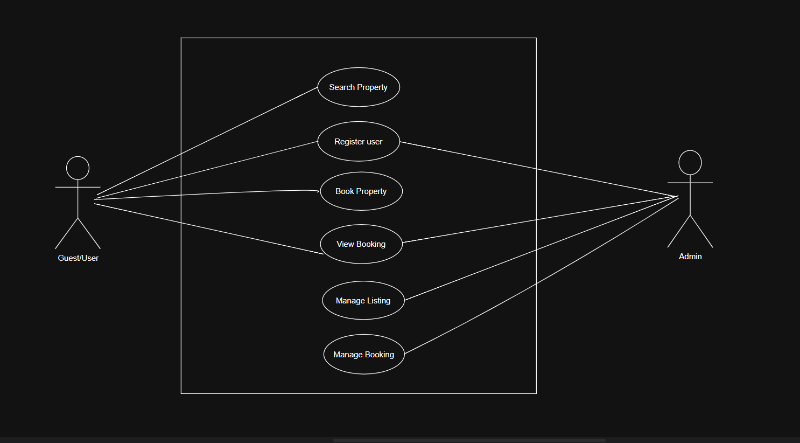

# Requirement Analysis in Software Development
## Introduction

This repository is dedicated to exploring **Requirement Analysis**, a critical phase in the Software Development Life Cycle (SDLC). 

### What is Requirement Analysis?

Requirement Analysis is the process where the project team gathers, analyzes, and defines the requirements of the software product to be developed. It ensures that all stakeholders have a shared and clear understanding of what the system should accomplish and how it should perform.

### Why is Requirement Analysis Important?

- **Clarity and Understanding:** Helps identify stakeholder expectations, reducing ambiguity.
- **Scope Definition:** Clearly defines the project scope to prevent scope creep.
- **Basis for Design and Development:** Lays the foundation for system design and implementation.
- **Cost and Time Estimation:** Enables accurate estimates for budget, resources, and timeline.
- **Quality Assurance:** Ensures the final product meets specified requirements, enhancing customer satisfaction.

  ### Key Activities in Requirement Analysis

Requirement Analysis includes several essential activities to ensure the successful definition and understanding of software requirements:

- **Requirement Gathering 🗂️**  
  Involves collecting information through interviews, surveys, workshops, observation, and document review.

- **Requirement Elicitation ✍️**  
  Engages stakeholders using techniques like brainstorming, focus groups, and prototyping to clarify needs.

- **Requirement Documentation 📚**  
  Converts gathered data into formal outputs like requirement specifications, user stories, and use cases.

- **Requirement Analysis and Modeling 📊**  
  Involves prioritizing, assessing feasibility, and visualizing requirements using models and diagrams.

- **Requirement Validation ✅**  
  Ensures requirements are accurate, complete, and aligned with stakeholder expectations through reviews and traceability.
### Types of Requirements

In software development, requirements are generally categorized into two types: **Functional** and **Non-functional**. Both are essential for building a complete and effective system.

#### Functional Requirements ⚙️

Functional requirements define **what the system should do** — the specific behaviors and functions it must support.

**Examples from a Booking Management System:**
- **Search Properties:** Users can search based on location, price, and availability.
- **User Registration:** New users can sign up and create accounts.
- **Property Listings:** Display detailed property information with images.
- **Booking System:** Users can book, view, and manage property reservations.
- **User Authentication:** Enable secure login and account access.

#### Non-functional Requirements 🛡️

Non-functional requirements describe **how the system should perform** — focusing on quality attributes rather than behaviors.

**Examples from the Booking Management System:**
- **Performance:** Pages load within 2 seconds and support up to 1000 concurrent users.
- **Security:** Data is encrypted, and the system is protected against vulnerabilities.
- **Scalability:** Can expand to handle growing traffic.
- **Usability:** Intuitive and user-friendly interface.
- **Reliability:** Ensures 99.9% uptime and quick recovery from failures.

### Use Case Diagrams 📊

#### What are Use Case Diagrams?

Use case diagrams visually represent how users (actors) interact with the system to accomplish specific goals (use cases). They help identify the main functionalities of the system from a user's perspective.

#### Benefits of Use Case Diagrams

- Clearly illustrate system functionalities and interactions.
- Help in organizing and understanding system requirements.
- Improve communication between stakeholders, developers, and analysts.

#### Use Case Diagram for Booking System

Below is an example use case diagram for a booking management system, showing key actors and interactions:

### Acceptance Criteria ✅

#### What is Acceptance Criteria?

Acceptance criteria are clearly defined conditions that a feature must fulfill to be accepted by stakeholders. They ensure that a feature meets both functional expectations and quality standards before it is considered complete.

#### Importance in Requirement Analysis

- Ensures mutual understanding of what success looks like for a feature.
- Serves as a measurable benchmark for testing and validation.
- Helps maintain quality, consistency, and user satisfaction.

#### How to Define Acceptance Criteria

- Be **specific**, **clear**, and **measurable**.
- Include both **functional** and **non-functional** elements.
- Align with user needs and project goals.

#### Example – Checkout Feature (Booking Management System)

**Feature:** Checkout Process

**Acceptance Criteria:**
- Users can select available dates for a property.
- Users can confirm the booking through a simple and secure process.
- A confirmation email is sent to the user within 2 minutes of successful booking.

